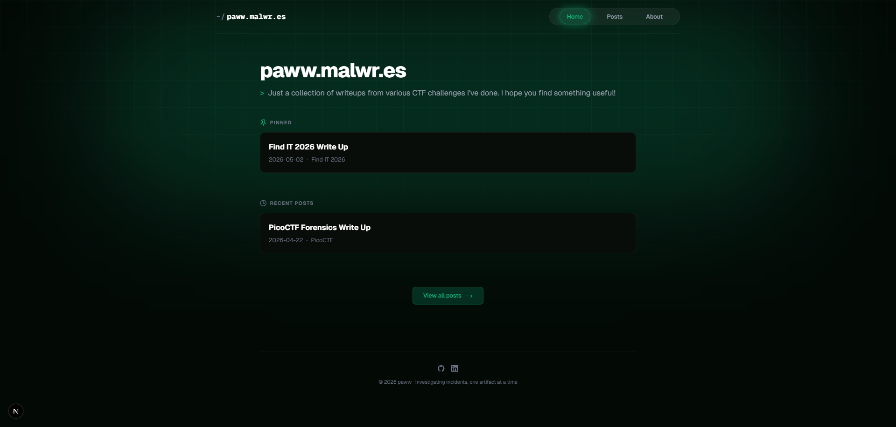

# paww.malwr.es | CTF Journey

> ⚠️ **Notice**: This repository is a personal archive and portfolio. It is **not** intended to be cloned, reused, or set up as a template by others. It serves purely as the codebase documentation for my personal CTF writeups and cybersecurity journey.

A modern, fast, and sleek Content Management System (CMS) built specifically for documenting Capture The Flag (CTF) writeups.

  

## 🚀 Overview

This custom-built CMS handles the public display and private management of my CTF writeups:
- **Dark & Glassmorphism UI**: Hacker-themed aesthetic with smooth animations powered by Framer Motion.
- **Rich Text Editor**: Integrated TipTap editor with support for Markdown-like features and direct Base64 image uploads.
- **Admin Dashboard**: Secure, hidden backend for managing writeups (Add, Edit, Delete).
- **Searchable Content**: Real-time filtering by title or competition name.
- **Responsive Design**: Flawless experience across desktop, tablet, and mobile devices.

## 🛠️ Tech Stack

- **Framework**: [Next.js](https://nextjs.org/) (App Router & Server Actions)
- **Styling**: [Tailwind CSS](https://tailwindcss.com/) & `@tailwindcss/typography`
- **Animations**: [Framer Motion](https://www.framer.com/motion/)
- **Database**: [Supabase](https://supabase.com/) (PostgreSQL)
- **Editor**: [TipTap](https://tiptap.dev/)
- **Icons**: [Lucide React](https://lucide.dev/)

## 📄 License

This repository and its contents are for personal documentation only. All writeups and associated content are the property of the author.